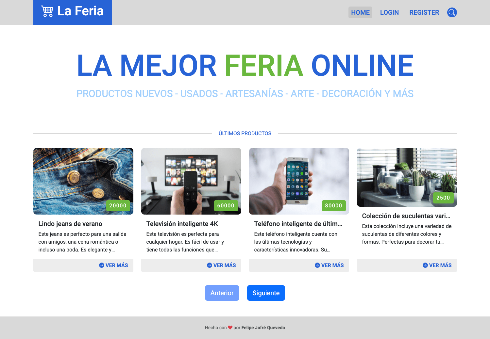

# 🛍️ La Feria

La Feria App es un sitio web de comercio electrónico que permite anunciar productos para la venta.

Se trata de un proyecto FullStack que representa el front-end de la aplicación.

## 👨‍💻 Para desarrollo
Estos son los requisitos para ejecutar la aplicación en desarrollo.
- node.js v18 en adelante

### ⚙️ Como usar
La pantalla de login solicita dos campos: correo electrónico y contraseña.
Para ingresar a la aplicación y crear publicaciones de pruebas solo debe completar el correo felipe@test.com y la contraseña dejar vacía o usar la que tiene por defecto.

### 🚀 Instalación
1. clonar repositorio ```git clone https://github.com/felipejoq/la-feria-app.git```
2. navegar a la carpeta del proyecto: ```cd la-feria-app```
3. instalar dependencias: ```npm install```
4. ejecutar la aplicación: ```npm start```
5. abrir el navegador en la dirección que indica la consola.

### 📸 Capturas de pantalla

